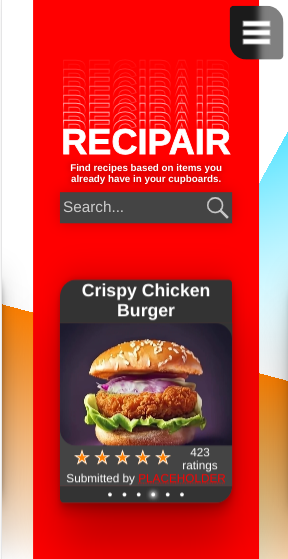

# Where to find?

[https://recipair.onrender.com/](https://recipair.onrender.com/), I'm using a free tier of render, so the site might take a few minutes to load if it hasn't had any visitors for a while. 

If you want to run it yourself, db dump is here: [recipair.sql](recipair.sql).

If you have any questions, add me on discord: wh1teh.

# HTML

### 1/5: Basic HTML structure is present.

[public/html/head.html](public/html/head.html), constructing site dynamically but this is one part of it, other parts are in the same folder.

###  2/5: HTML structure with clear content differentiation (headings, paragraphs, lists).

Using h1, h2..., paragrahps, spans etc., nav uses list.

### 3/5: Use of forms, links, and media.

Landing page includes these all.

### 4/5: Tables are effectively used.

You can find an example of a table on the recipe page.

### 5/5: Consistent use of semantic HTML throughout, ensuring better structure and understanding of the content.

Using nav header, footer, constructing recipe page using section etc.

# CSS

### 1/5: Basic CSS styling (colors, fonts).

[public/stylesheets/style.css#37](public/stylesheets/style.css#L37)

### 2/5: Use of classes and IDs to style specific elements.

class and attribute selectors throughout, ID selectors aren't as reusable.

### 3/5: Implementation of responsive design elements.

I'm trying to use device viewport units and percentages as much as possible, and variables for more static type units.

### 4/5: Use of layouts for advanced user interfaces (arrays, float, flexbox, css grid)

flex is life.

### 5/5: Styling demonstrates a strong grasp of layout principles, aesthetics, and user experience.

# JavaScript Basics

### 1/5: Simple interactions (like alerts on button click).

[public/scripts/splash.js:22](public/scripts/splash.js#L22), submit a form.

### 2/5: Multiple event listeners and basic DOM manipulations.

[public/scripts/footer.js:3](public/scripts/footer.js#L3), if on desktop, flip open footer upon scrolling down.

### 3/5: Use of arrays, objects, and functions.

[public/scripts/splash.js](public/scripts/splash.js) uses arrays to track elements and recipes, handles json and other objects, use of variety of functions.

### 4/5: Advanced logic, looping through data, and dynamic DOM updates.

[public/scripts/splash.js:516](public/scripts/splash.js#L516), functional slider on mobile, works on desktop by clicking the little dots under the featured recipe box.

### 5/5: Consistent use of Object-Oriented JavaScript principles.
[public/scripts/classes/helper.js](public/scripts/classes/helper.js), I have for example created a helper class that has a bunch of methods that can be possibly reused elsewhere.

# Asynchronous Operations

### 1/5: Use of timers.

[public/scripts/splash.js:78](public/scripts/splash.js#L78), an example of a timer used to time a fadeout animation.

### 2/5: Successful implementation of an AJAX call or Fetch.

[public/scripts/splash.js:45](public/scripts/splash.js#L45), search recipes based on ingredients from database using regex.

### 3/5: Data from the asynchronous call is displayed on the webpage.

[public/scripts/splash.js:133](public/scripts/splash.js#L133), recipe info is then printed on the webpage.

### 4/5: Error handling is implemented (for failed API calls, etc.).

[public/scripts/splash.js:71](public/scripts/splash.js#L71), display error message above searchbar if no matches were found.

### 5/5: Effective use of asynchronous data to enhance user experience (like filtering, sorting).

[public/scripts/classes/helper.js:133](public/scripts/classes/helper.js#L33), sorts data based on rating and puts them in a "zigzag" order, so that you get worse results on the edges and best ones in the middle.

